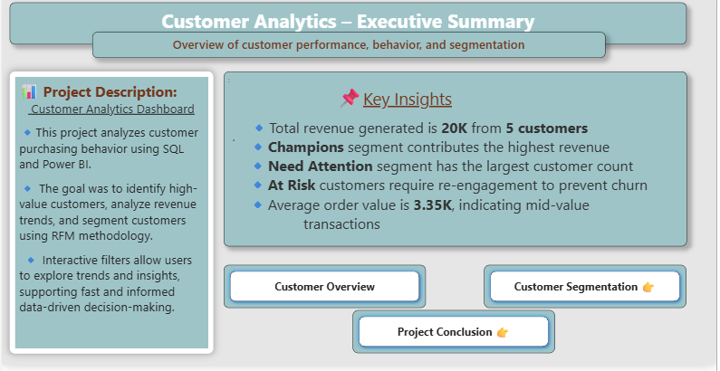
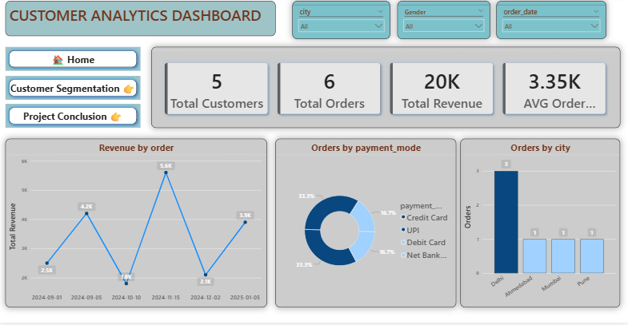
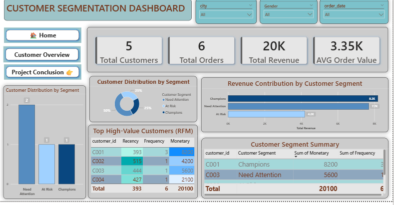
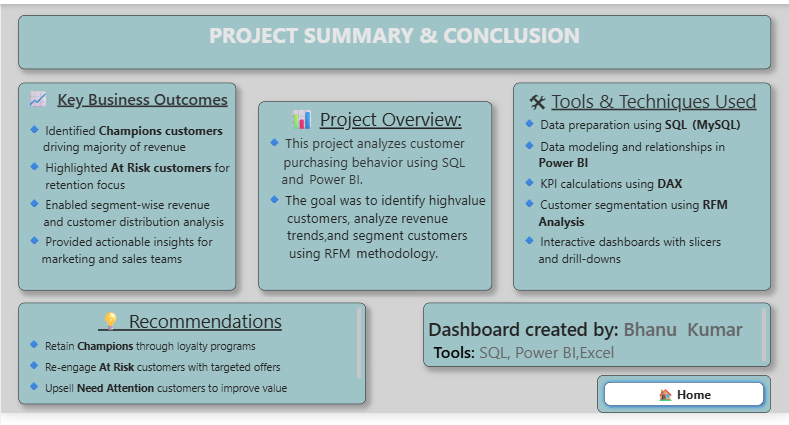

## 📊 Customer Analytics & RFM Segmentation Dashboard

### 📌 Project Overview
This project presents an end-to-end customer analytics solution built using SQL and Power BI. It analyzes customer purchasing behavior, revenue trends, and customer value to support data-driven business decisions using RFM (Recency, Frequency, Monetary) segmentation.

---
## 📸 Dashboard Screenshots

### Home – Executive Summary

### Customer Overview

### Customer Segmentation

### Project Summary

### 🛠 Tools & Technologies
- SQL (MySQL)
- Power BI
- Excel

---

### 📊 Dashboards Included
- Executive Summary (Home Page)
- Customer Overview Dashboard
- Customer Segmentation Dashboard
- Project Summary & Conclusion

---

### 🔍 Key Insights
- Champions customers contribute the highest revenue
- Need Attention segment has the largest customer base
- At Risk customers require re-engagement to prevent churn
- Average order value indicates mid-value transactions

---

### 💡 Business Recommendations
- Retain Champions through loyalty programs
- Re-engage At Risk customers with targeted offers
- Upsell Need Attention customers to increase customer value

---

### 👤 Author
**Bhanu Kumar**  
Tools: SQL | Power BI | Excel

